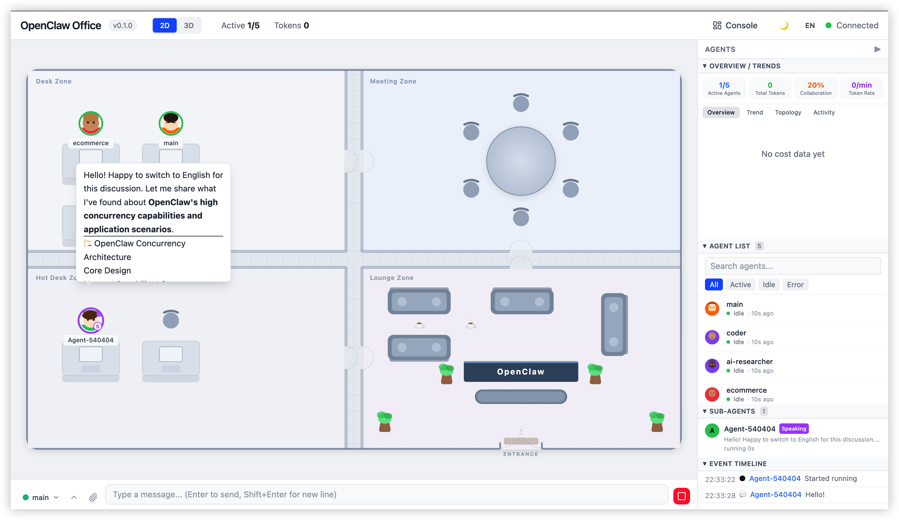
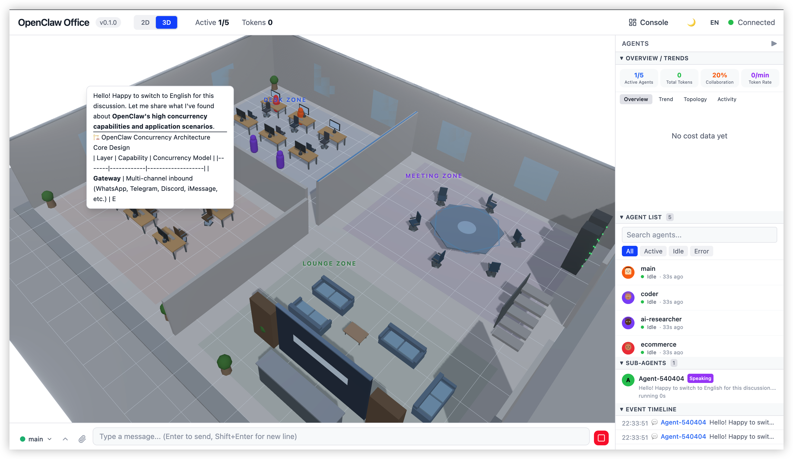
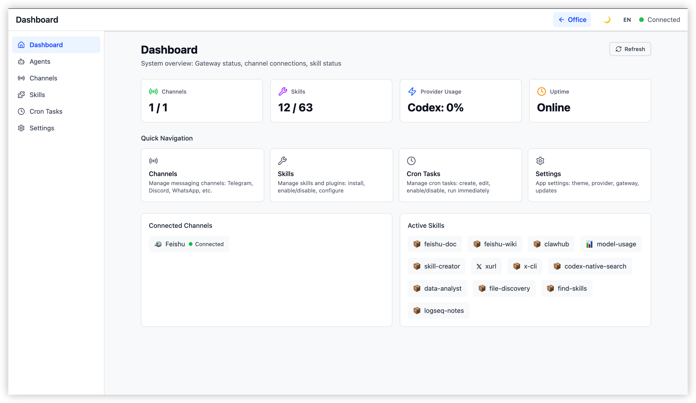
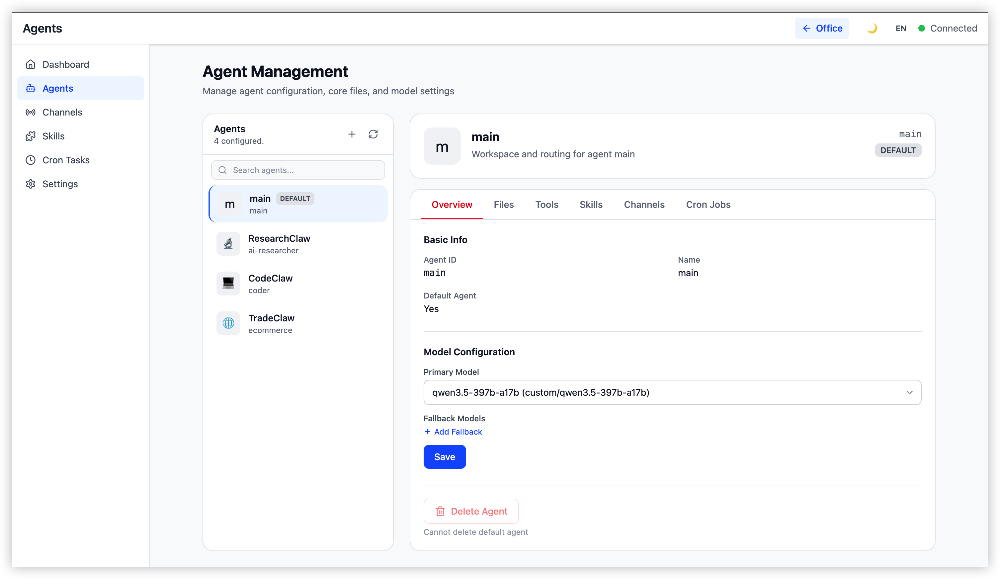
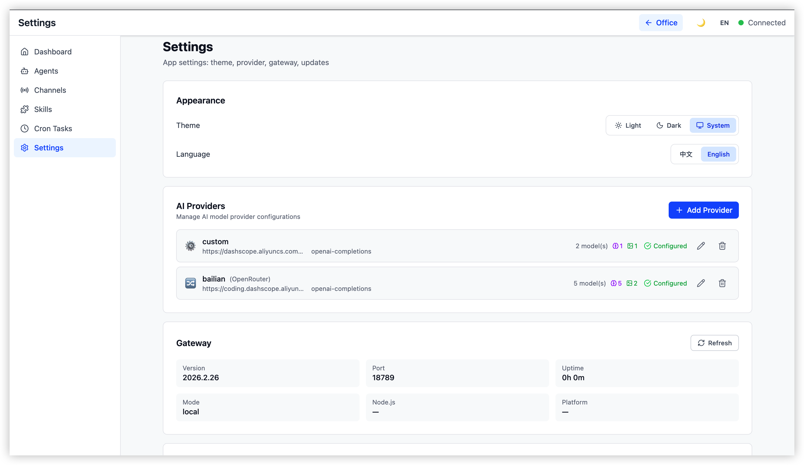

# OpenClaw Office

> [English](./README.md)

> 将 AI 智能体的协作逻辑具象化为实时的数字孪生办公室。

**OpenClaw Office** 是 [OpenClaw](https://github.com/openclaw/openclaw) Multi-Agent 系统的可视化监控与管理前端。它通过等距投影（Isometric）风格的虚拟办公室场景，实时展示 Agent 的工作状态、协作链路、工具调用和资源消耗，同时提供完整的控制台管理界面。

**核心隐喻：** Agent = 数字员工 | 办公室 = Agent 运行时 | 工位 = Session | 会议室 = 协作上下文

---

## 功能概览

### 虚拟办公室

- **2D 平面图** — SVG 渲染的等距办公室场景，包含工位区、临时工位、会议区和丰富的家具（桌椅/沙发/植物/咖啡杯）
- **3D 场景** — React Three Fiber 3D 办公室，含角色模型、技能全息面板、传送门特效和后处理效果
- **Agent 头像** — 基于 agentId 确定性生成的 SVG 头像，支持实时状态动画（空闲/工作中/发言/工具调用/错误）
- **协作连线** — Agent 间消息传递的可视化连接
- **气泡面板** — 实时 Markdown 文本流和工具调用展示
- **侧边面板** — Agent 详情、Token 折线图、成本饼图、活跃热力图、子 Agent 关系图、事件时间轴

### Chat 聊天

- 底部停靠的聊天栏，支持与 Agent 实时对话
- Agent 选择器、流式消息展示、Markdown 渲染
- 聊天历史抽屉和时间轴视图





### 控制台

完整的系统管理界面：

| 页面 | 功能 |
|------|------|
| **Dashboard** | 概览统计卡片、告警横幅、Channel/Skill 概览、快捷导航 |
| **Agents** | Agent 列表/创建/删除，详情多 Tab（Overview/Channels/Cron/Skills/Tools/Files） |
| **Channels** | 渠道卡片、配置对话框、统计、WhatsApp QR 绑定流程 |
| **Skills** | 技能市场、安装选项、技能详情 |
| **Cron** | 定时任务管理和统计 |
| **Settings** | Provider 管理（添加/编辑/模型编辑器）、外观/Gateway/开发者/高级/关于/更新 |







### 其他特性

- **国际化** — 完整的中英文双语支持，运行时语言切换
- **Mock 模式** — 无需连接 Gateway 即可开发
- **响应式** — 移动端优化，自动切换 2D 模式

---

## 技术栈

| 层 | 技术 |
|-----|------|
| 构建工具 | Vite 6 |
| UI 框架 | React 19 |
| 2D 渲染 | SVG + CSS Animations |
| 3D 渲染 | React Three Fiber (R3F) + @react-three/drei |
| 状态管理 | Zustand 5 + Immer |
| 样式 | Tailwind CSS 4 |
| 路由 | React Router 7 |
| 图表 | Recharts |
| 国际化 | i18next + react-i18next |
| 实时通信 | 原生 WebSocket（对接 OpenClaw Gateway） |

---

## 前提条件

- **Node.js 22+**
- **pnpm**（包管理器）
- **[OpenClaw](https://github.com/openclaw/openclaw)** 已安装并配置

OpenClaw Office 是一个配套前端，连接到正在运行的 OpenClaw Gateway。它**不会**启动或管理 Gateway。

---

## 快捷启动

无需克隆仓库，最快速的运行方式：

```bash
# 直接运行（一次性使用）
npx @ww-ai-lab/openclaw-office

# 或全局安装
npm install -g @ww-ai-lab/openclaw-office
openclaw-office
```

服务默认启动在 `http://localhost:5180`。可通过环境变量自定义：

```bash
PORT=3000 openclaw-office          # 自定义端口
HOST=127.0.0.1 openclaw-office     # 仅绑定本地地址
```

> **说明：** 此方式运行的是预构建的生产版本。如需热重载开发，请参见下方 [开发](#开发) 部分。

---

## 快速开始（从源码）

### 1. 安装依赖

```bash
pnpm install
```

### 2. 配置 Gateway 连接

创建 `.env.local` 文件（已在 `.gitignore` 中，不会被提交），填入 Gateway 连接信息：

```bash
cat > .env.local << 'EOF'
VITE_GATEWAY_URL=ws://localhost:18789
VITE_GATEWAY_TOKEN=<你的 gateway token>
EOF
```

获取 Gateway token：

```bash
openclaw config get gateway.auth.token
```

### 3. 启用 Device Auth Bypass（必须）

OpenClaw Office 是纯 Web 应用，无法提供 Gateway 2026.2.15+ 要求的 Ed25519 device identity 签名。需要配置 Gateway 绕过此要求：

```bash
openclaw config set gateway.controlUi.dangerouslyDisableDeviceAuth true
```

配置后需**重启 Gateway**。

> **安全提示：** 此 bypass 配置仅建议在本地开发环境使用。生产环境应通过反向代理或其他安全机制处理认证。

### 4. 启动 Gateway

确保 OpenClaw Gateway 在配置的地址上运行（默认 `localhost:18789`）。可通过以下方式启动：

- OpenClaw macOS 应用
- `openclaw gateway run` CLI 命令
- 其他部署方式（参见 [OpenClaw 文档](https://github.com/openclaw/openclaw)）

### 5. 启动开发服务器

```bash
pnpm dev
```

在浏览器中打开 `http://localhost:5180`。

### 环境变量

| 变量 | 必须 | 默认值 | 说明 |
|------|------|--------|------|
| `VITE_GATEWAY_URL` | 否 | `ws://localhost:18789` | Gateway WebSocket 地址 |
| `VITE_GATEWAY_TOKEN` | 是（连接真实 Gateway 时） | — | Gateway 认证 token |
| `VITE_MOCK` | 否 | `false` | 启用 Mock 模式（不需要 Gateway） |

### Mock 模式（无需 Gateway）

如需在没有运行中的 Gateway 的情况下开发，启用 Mock 模式：

```bash
VITE_MOCK=true pnpm dev
```

这会使用模拟的 Agent 数据进行 UI 开发。

---

## 项目结构

```
OpenClaw-Office/
├── src/
│   ├── main.tsx / App.tsx           # 入口与路由
│   ├── i18n/                        # 国际化（zh/en）
│   ├── gateway/                     # Gateway 通信层
│   │   ├── ws-client.ts             # WebSocket 客户端 + 认证 + 重连
│   │   ├── rpc-client.ts            # RPC 请求封装
│   │   ├── event-parser.ts          # 事件解析 + 状态映射
│   │   └── mock-adapter.ts          # Mock 模式适配器
│   ├── store/                       # Zustand 状态管理
│   │   ├── office-store.ts          # 主 Store（Agent 状态、连接、UI）
│   │   └── console-stores/          # 控制台各页面 Store
│   ├── components/
│   │   ├── layout/                  # AppShell / ConsoleLayout / Sidebar / TopBar
│   │   ├── office-2d/               # 2D SVG 平面图 + 家具
│   │   ├── office-3d/               # 3D R3F 场景
│   │   ├── overlays/                # HTML Overlay（气泡等）
│   │   ├── panels/                  # 详情/指标/图表面板
│   │   ├── chat/                    # Chat 停靠栏
│   │   ├── console/                 # 控制台功能组件
│   │   ├── pages/                   # 控制台路由页面
│   │   └── shared/                  # 公共组件
│   ├── hooks/                       # 自定义 Hooks
│   ├── lib/                         # 工具库
│   └── styles/                      # 全局样式
├── public/                          # 静态资源
├── tests/                           # 测试文件
├── package.json
├── vite.config.ts
└── tsconfig.json
```

---

## 开发

### 命令

```bash
pnpm install              # 安装依赖
pnpm dev                  # 启动开发服务器 (port 5180)
pnpm build                # 构建生产版本
pnpm test                 # 运行测试
pnpm test:watch           # 测试 watch 模式
pnpm typecheck            # TypeScript 类型检查
pnpm lint                 # Oxlint 检查
pnpm format               # Oxfmt 格式化
pnpm check                # lint + format 检查
```

### 架构

OpenClaw Office 通过 WebSocket 连接 Gateway，数据流如下：

```
OpenClaw Gateway  ──WebSocket──>  ws-client.ts  ──>  event-parser.ts  ──>  Zustand Store  ──>  React 组件
     │                                                                          │
     └── RPC (agents.list, chat.send, ...)  ──>  rpc-client.ts  ──────────────>─┘
```

Gateway 广播实时事件（`agent`、`presence`、`health`、`heartbeat`）并响应 RPC 请求。前端将 Agent 生命周期事件映射为可视化状态（idle/working/speaking/tool_calling/error），在办公室场景中渲染。

---

## 贡献

欢迎任何贡献！无论是新的可视化效果、3D 模型改进、控制台功能还是性能优化。

1. Fork 本仓库
2. 创建特性分支 (`git checkout -b feature/cool-effect`)
3. 提交更改（使用 [Conventional Commits](https://www.conventionalcommits.org/) 格式）
4. 开启 Pull Request

---

## 许可证

[MIT](./LICENSE)
